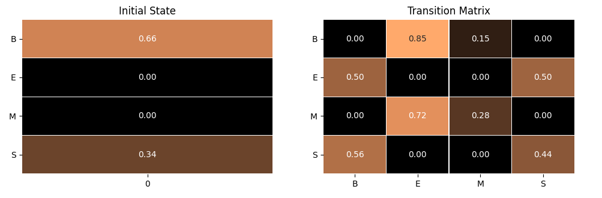

# hmm-ner-cws


## Markov Chain

HMM建立在MarkovChain上，下图是MarkovChain的参数可视化：



## HMM

经典的HMM模型用于NER和CWS任务。

使用HMM进行中文分词，

```bash
$ python3 task_cws.py
```

使用HMM进行NER，

```bash
$ python3 task_ner.py
```


状态矩阵的可视化：


## 对比jieba

jieba分词的HMM已经带有权重，这里实现的HMM使用ctb6训练权重，对比代码如下：


```python
import jieba
from task_cws import tokenizer
import dataset

for text in dataset.load_sentences():
    print(jieba.lcut(text, HMM=True))
    print(tokenizer.cut(text))
```

结果如下，

```text
['守得云', '开见', '月', '明']
['守得', '云开', '见月', '明']
['乒乓球', '拍卖', '完', '了']
['乒乓球', '拍卖', '完', '了']
['无线电', '法国', '别', '研究']
['无线', '电法', '国别', '研究']
['广东省', '长假', '成绩单']
['广东', '省长', '假', '成绩', '单']
['欢迎', '新', '老师', '生前', '来', '就餐']
['欢迎', '新', '老师', '生前', '来', '就', '餐']
```

